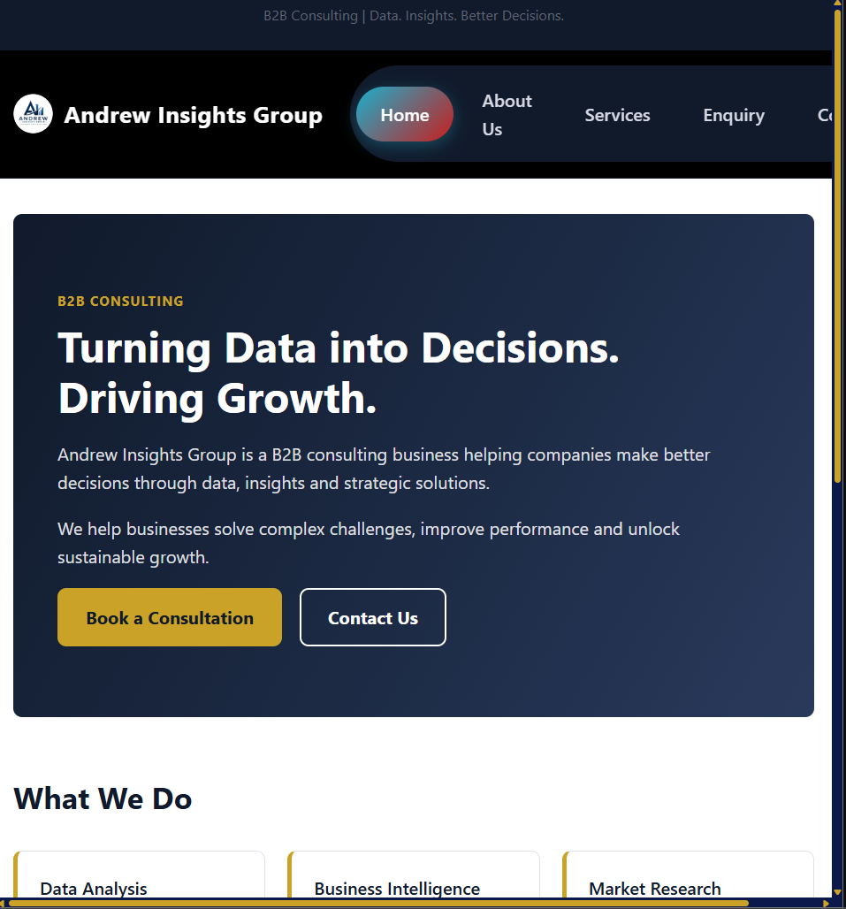

# Andrew Insights Group — Website

A five-page brand website for **Andrew Insights Group**, a B2B consulting business
(Data Analysis, Business Intelligence, Market Research, Strategic Insights, Business
Strategy, Operational Support, Decision Support, Growth Enablement).

**Student:** Tshelane, ST10528379
**Module:** WEDE5020 — Web Development

## Pages

| Page | File |
|---|---|
| Home | `index.html` |
| About Us | `about.html` |
| Services / Products | `services.html` |
| Enquiry | `enquiry.html` |
| Contact | `contact.html` |

## Structure

```
AndrewInsightsGroup/
├── index.html
├── about.html
├── services.html
├── enquiry.html
├── contact.html
├── css/
│   └── style.css
└── README.md
```

## How to view

Open `index.html` in any modern browser (Chrome, Edge, or Firefox). No build step or
server is required — all pages link to `css/style.css` directly.

## Screenshot evidence (to add before submission)

Add screenshots of `index.html` (and ideally one other page) at each of the following
widths, using your browser's DevTools device toolbar, and paste them into this section:

- **Desktop** — 1440px or wider (4-column / full nav)
- **Tablet** — ~768px (2-column services grid)
- **Mobile** — ~375px (single column, hamburger menu)

## Changelog

### Part 2 — CSS Styling and Responsive Design (custom scrollbar)

- Added a custom scrollbar style: a dark navy track with a gold thumb (matching the
  brand palette), using `::-webkit-scrollbar` for Chrome/Edge/Safari and
  `scrollbar-width` / `scrollbar-color` for Firefox.


### Part 2 — CSS Styling and Responsive Design (logo added)

- Added the real Andrew Insights Group logo. The circular mark was cropped out of a
  supplied screenshot and saved as `images/logo.png` (transparent background) and a
  64×64 `images/favicon.png`. The header logo link now shows the mark next to the
  wordmark (`.logo-img`), and the favicon is linked from every page's `<head>`.

### Part 2 — CSS Styling and Responsive Design (update)

- Replaced the site navigation with a dark, rounded "pill" nav bar (dark grey
  capsule, red gradient highlight on the current page, per a reference design
  supplied by the student), added as `.nav-pill` on the `<ul>` inside `.main-nav`.
  The header background was darkened to `#0d0d0d` to match, and the mobile hamburger
  icon/outline colours were switched to white so they stay visible against it. On
  narrow screens the pill stacks into a vertical rounded menu instead of a horizontal
  row.

### Part 2 — CSS Styling and Responsive Design

- Fixed a broken navigation link from Part 1: the About Us file was saved as
  `about us.html` (with a space), while every page's nav linked to `about.html`. The
  file has been renamed to `about.html` and every page's link now resolves correctly.
  This also brings the filename in line with the lowercase, no-spaces naming
  convention used for every other page.
- Created an external stylesheet, `css/style.css`, and linked it from the `<head>` of
  all five pages.
- Added a CSS reset (`box-sizing: border-box`, cleared default margin/padding) and a
  consistent base style (font family, base text colour, link colours) applied
  site-wide.
- Applied a typographic scale (`h1`–`h3`, body copy) using `rem` units so text sizing
  respects the visitor's own browser font-size settings.
- Added a reusable `.container` class to centre and constrain page content, plus
  `.section` / `.section-alt` helpers for consistent vertical spacing and alternating
  backgrounds.
- Restructured the header markup to add a `.site-header` / `.header-inner` layout
  (Flexbox), a logo link, and a hidden-checkbox + label "hamburger" toggle
  (`.nav-toggle-input` / `.nav-toggle`) that opens and closes the mobile menu using
  only CSS (`:checked` and the `~` general sibling combinator) — no JavaScript.
- Restyled the footer (`.site-footer`, `.footer-inner`) using Flexbox with
  `flex-wrap: wrap`, so the footer columns sit side by side on desktop and stack on
  narrow screens.
- Turned the homepage "What We Do" list into a responsive card grid
  (`.services-grid`, CSS Grid with `repeat(auto-fit, minmax(...))`) that reflows its
  column count automatically as the window is resized.
- Restructured the eight Services page items from plain `h2`/`p` pairs into individual
  `.service-card` elements laid out with an explicit `grid-template-columns` grid
  (1 column on mobile, 2 on tablet, 4 on desktop) using `min-width` media queries.
  This was a deliberate change from Part 1's flat list, made specifically so the
  content could be styled as an even, responsive card grid per the Part 2 brief.
- Added a gradient hero banner (`.hero`) to the homepage using the brand's navy and
  gold colour palette, with a `linear-gradient` background instead of a stock photo,
  plus primary/secondary call-to-action buttons (`.btn`, `.btn-primary`,
  `.btn-secondary-light`).
- Styled the Enquiry and Contact forms (`.form-card`, `.form-group`) with consistent
  input/select/textarea styling, visible `:focus` states, and a full-width success
  button (`.btn-success.btn-block`) for submission.
- Added `:hover` and `:focus-visible` states throughout (nav links, buttons, cards,
  footer icons) so interactive elements give clear visual feedback, including for
  keyboard-only navigation.
- Added responsive breakpoints via `@media` queries: a `max-width: 700px` query
  switches on the mobile navigation menu and adjusts heading sizes and hero padding;
  `min-width: 560px` / `min-width: 900px` queries step the services grid from 1 → 2 →
  4 columns.
- Used relative units (`rem` for type, `%`/`fr`/`auto-fit` for grid and flex sizing,
  `ch` for readable paragraph widths) throughout, rather than fixed pixel widths, so
  the layout scales rather than breaking at arbitrary sizes.

### Part 1 (prior submission)

- Built the initial five-page HTML structure: Home, About Us, Services, Enquiry,
  Contact, each with a shared header/nav and footer.
- Added the initial Enquiry form (name, company, email, phone, service dropdown,
  message) and Contact page content.

### Screenshot evidence of the different screen sizes(desktop, tablet, mobile)




## References

- MDN Web Docs — HTML (developer.mozilla.org)
- MDN Web Docs — CSS (developer.mozilla.org)
- MDN — CSS Flexbox layout guide (developer.mozilla.org)
- MDN — CSS Grid layout guide (developer.mozilla.org)
- CSS-Tricks — A Complete Guide to Flexbox (css-tricks.com)
- CSS-Tricks — A Complete Guide to Grid (css-tricks.com)
- web.dev — Learn CSS (web.dev)
- W3C Markup Validator (validator.w3.org)
- W3C Web Accessibility Initiative — Introduction to Web Accessibility (w3.org/WAI)
- WebAIM — Introduction to Web Accessibility (webaim.org)
- WEDE5020 course materials: "Building Your Website's HTML" and "Styling Your
  Website with CSS" tutorials (2026)
- Youtube - CSS navigation bar styles

